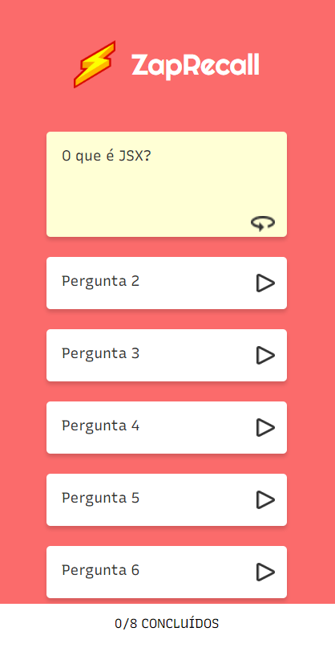
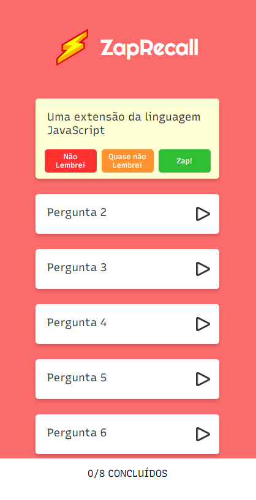

# Zap Recall

- Flashcards are cards that contain a question/statement on the front and an answer on the back. They can be used to train your memory using the Active Recall and Spaced Repetition methodologies. The idea is to read the question or statement and try to remember the answer. When encountering it, depending on the effort required to answer the flashcard or not, you become aware of which contents are fresh in your memory and which are not, so you can practice the ones that aren't frequently.
- When we instantly recall a flashcard, we had a **"Zap!"** ⚡

# Demo
[You can test it HERE](https://projeto9-zaprecall-pearl.vercel.app/)

# Tech Used
For this project i used

- React
- Vite
- Styled Components

# Preview
<div align="center">
    
   
    
</div>
</br>
</br>
<div align="center">
    
</div>
</br>
</br>

# Installation and Running
To run ZapRecall on your local machine or server, follow these steps:

</br>

- Open up your command line

</br>

1. Clone this repository:
```bash 
git clone https://github.com/DarlanSchwartz/ZapRecall.git
```
2. Navigate to the project directory:
```bash 
cd ZapRecall
```
3. Install the required dependencies
```bash 
npm install
```
4. Run the project

```bash 
npm run dev
```
5. Open http://localhost:5173/

